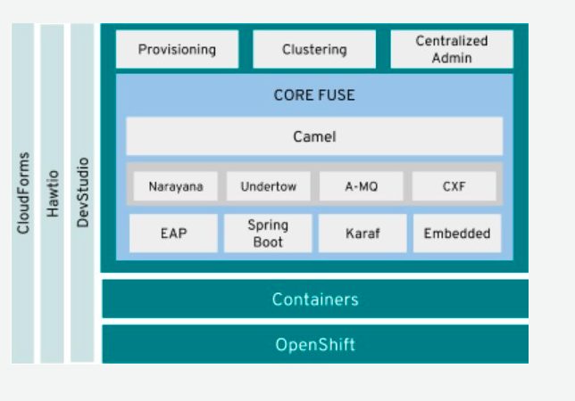
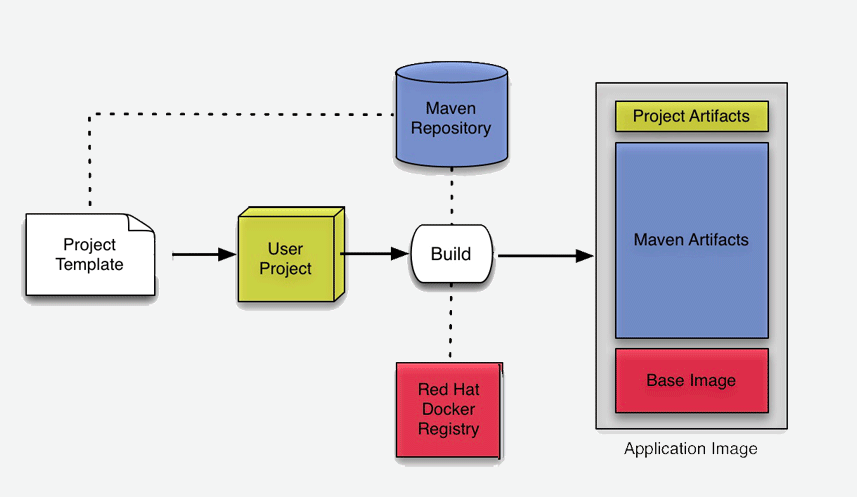
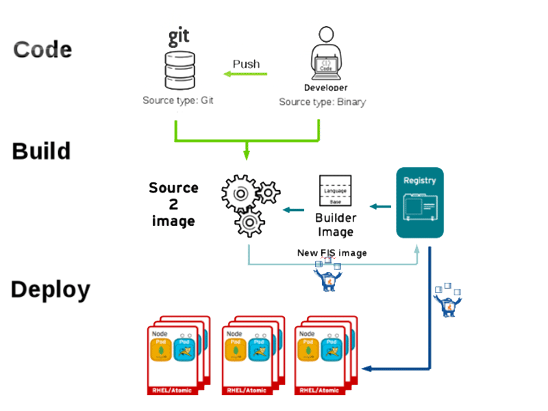

:data-uri:
:toc: left
:markup-in-source: +verbatim,+quotes,+specialcharacters
:source-highlighter: rouge
:icons: font
:stylesdir: stylesheets
:stylesheet: colony.css

= Understand Fuse 7.5 on OpenShift

.Goals
* Benefits of Fuse on OpenShift Benefits
* Understand Administrating tasks for Fuse on OpenShift
* Explaining how to start developing for Fuse on OpenShift

:sectnums:

== Benefits Fuse on OpenShift

* Native integration with Docker, Kubernetes, OpenShift
* Transparency in platform changes for developers
* Self-service, scaling, CI/CD for administrators
* Application runtime built for microservice deployments

[#img-overview]
[caption="Figure 1: Fuse on OpenShift Overview"]

== Administrators Tasks

The main administrating tasks will typically be

* Installing Fuse imagestreams and templates on the OpenShift 4.x server
* Set up the Fuse Console on OpenShift 4.x
* Installing API Designer on OpenShift 4.x - (http://apicur.io[Apicurio]) (Optional, through OperatorHub)

=== Installing Fuse imagestreams and templates on the OpenShift 4.x server

* ImageStrams, is an OpenShift API object that represent Single virtual view of related images.
* For Installing Fuse imagestreams and templates, You must have the administrator role for the OpenShift project.
+
. Type of Red Hat Fuse 7 images:
.. fuse-karaf-openshift: Camel applications based on Karaf
.. fuse-java-openshift: Camel applications based on standalone Java™ flat file or Spring Boot
.. fuse-eap-openshift: Camel applications based on JBoss EAP
+
. Install Red Hat Fuse 7 images:
+

You can refer to,  https://github.com/rahmed-rh/fuse_on_OCP_7.5/blob/master/scripts/install_fis_7.5.sh[script for installing image streams and templates].

=== Setting up the Fuse Console on OpenShift 4.x

On OpenShift 4.x, you can choose one of these Fuse Console deployment options:

. cluster - The Fuse Console can discover and connect to Fuse applications deployed across multiple namespaces (projects) on the OpenShift cluster. To deploy this template, you must have the administrator role for the OpenShift cluster.
** https://github.com/rahmed-rh/fuse_on_OCP_7.5/blob/master/scripts/install_fuse_console_namespace.sh[script for installing fuse console for cluster]
. namespace - The Fuse Console has access to a specific OpenShift project (namespace). To deploy this template, you must have the administrator role for the OpenShift project.
** https://github.com/rahmed-rh/fuse_on_OCP_7.5/blob/master/scripts/install_fuse_console_cluster.sh[script for installing fuse console for namespace]

== Getting Start for Developer

=== Maven Archetypes

Used to generate new project with required resources and POM dependencies

* Archetype catalog located in Maven repositories:
+
** https://repo.fusesource.com/nexus/content/groups/public/[Red Hat Fuse]
+
** https://maven.repository.redhat.com/ga/[Red Hat GA]

=== Archetype types

==== Karaf & Spring Boot 1.5

Example command to create project:

[source,bash]
----
mvn org.apache.maven.plugins:maven-archetype-plugin:2.4:generate \
  -DarchetypeCatalog=https://maven.repository.redhat.com/ga/io/fabric8/archetypes/archetypes-catalog/2.2.0.fuse-750020-redhat-00002/archetypes-catalog-2.2.195.redhat-000032-archetype-catalog.xml \
  -DarchetypeGroupId=org.jboss.fuse.fis.archetypes \
  -DarchetypeVersion=2.2.0.fuse-750020-redhat-00002 \
  -DarchetypeArtifactId=<archetype-name>
----

.Available Archetypes
[width="80%",cols="4,6",options="header"]
|=========================================================
|Archetype Name |Template Application Created

|spring-boot-camel-archetype
|Demonstrates how to use Apache Camel with Spring Boot based on a fabric8 Java base image.

|spring-boot-camel-amq-archetype
|Demonstrates how to connect a Spring Boot application to an ActiveMQ broker and use JMS messaging between two Camel routes using Kubernetes or OpenShift.

|spring-boot-camel-config-archetype
|Demonstrates how to configure a Spring Boot application using Kubernetes ConfigMaps and Secrets.

|spring-boot-camel-drools-archetype
|Demonstrates how to use Apache Camel to integrate a Spring Boot application running on Kubernetes or OpenShift with a remote Kie Server.

|spring-boot-camel-infinispan-archetype
|Demonstrates how to connect a Spring Boot application to a JBoss Data Grid or Infinispan server using the Hot Rod protocol.

|spring-boot-camel-rest-3scale-archetype
|Demonstrates how to use Camel’s REST DSL to expose a RESTful API and expose it to 3scale.

|spring-boot-camel-rest-sql-archetype
|Demonstrates how to use SQL via JDBC along with Camel’s REST DSL to expose a RESTful API.

|spring-boot-camel-xa-archetype
|Spring Boot, Camel and XA Transactions. This example demonstrates how to run a Camel Service on Spring Boot that supports XA transactions on two external transactional resources: a JMS resource (A-MQ) and a database (PostgreSQL). This quickstart requires the PostgreSQL database and the A-MQ broker have been deployed and running first, one simple way to run them is to use the templates provided in the Openshift service catalog

|spring-boot-camel-xml-archetype
|Demonstrates how to configure Camel routes in Spring Boot via a Blueprint configuration file.

|spring-boot-cxf-jaxrs-archetype
|Demonstrates how to use Apache CXF with Spring Boot based on a fabric8 Java base image. The quickstart uses Spring Boot to configure an application that includes a CXF JAXRS endpoint with Swagger enabled.

|spring-boot-cxf-jaxws-archetype
|Demonstrates how to use Apache CXF with Spring Boot based on a fabric8 Java base image. The quickstart uses Spring Boot to configure an application that includes a CXF JAXWS endpoint.

|karaf2-cxf-rest-archetype
|RESTful web service example using CXF

|karaf2-camel-rest-sql-archetype
|Camel example using REST DSL with SQL database

|karaf2-camel-amq-archetype
|ActiveMQ and Camel Example

|karaf2-camel-log-archetype
|Camel log example

|=========================================================

==== Spring Boot 2

[TIP]
====
* For more information see https://access.redhat.com/documentation/en-us/red_hat_fuse/7.5/html-single/deploying_into_spring_boot/index[Deploying into Spring Boot]
* For more information on all of the differences between Spring Boot 1 and Spring Boot 2,
see https://github.com/spring-projects/spring-boot/wiki/Spring-Boot-2.0-Migration-Guide[Spring Boot’s Migration Guide]
and https://github.com/spring-projects/spring-boot/wiki/spring-boot-2.0-release-notes[Spring Boot 2 Release Notes].

====

Example command to create project:

[source,bash]
----
mvn org.apache.maven.plugins:maven-archetype-plugin:2.4:generate \
  -DarchetypeCatalog=https://maven.repository.redhat.com/ga/io/fabric8/archetypes/archetypes-catalog/2.2.0.fuse-sb2-750011-redhat-00006/archetypes-catalog-2.2.0.fuse-sb2-750011-redhat-00006-archetype-catalog.xml \
  -DarchetypeGroupId=org.jboss.fuse.fis.archetypes \
  -DarchetypeVersion=2.2.0.fuse-sb2-750011-redhat-00006 \
  -DarchetypeArtifactId=<archetype-name>
----

.Available Archetypes
[width="80%",cols="4,6",options="header"]
|=========================================================
|Archetype Name |Template Application Created

|spring-boot-camel-archetype
|Demonstrates how to use Apache Camel with Spring Boot based on a fabric8 Java base image.

|spring-boot-camel-amq-archetype
|Demonstrates how to connect a Spring Boot application to an ActiveMQ broker and use JMS messaging between two Camel routes using Kubernetes or OpenShift.

|spring-boot-camel-drools-archetype
|Demonstrates how to use Apache Camel to integrate a Spring Boot application running on Kubernetes or OpenShift with a remote Kie Server.

|spring-boot-camel-infinispan-archetype
|Demonstrates how to connect a Spring Boot application to a JBoss Data Grid or Infinispan server using the Hot Rod protocol.

|spring-boot-camel-rest-3scale-archetype
|Demonstrates how to use Camel’s REST DSL to expose a RESTful API and expose it to 3s750029cale.

|spring-boot-camel-rest-sql-archetype
|Demonstrates how to use SQL via JDBC along with Camel’s REST DSL to expose a RESTful API.

|spring-boot-camel-xml-archetype
|Demonstrates how to configure Camel routes in Spring Boot via a Blueprint configuration file.

|spring-boot-cxf-jaxrs-archetype
|Demonstrates how to use Apache CXF with Spring Boot based on a fabric8 Java base image. The quickstart uses Spring Boot to configure an application that includes a CXF JAXRS endpoint with Swagger enabled.

|spring-boot-cxf-jaxws-archetype
|Demonstrates how to use Apache CXF with Spring Boot based on a fabric8 Java base image. The quickstart uses Spring Boot to configure an application that includes a CXF JAXWS endpoint.

|=========================================================

==== Set Up Maven Archetype Catalog in JBoss Developer Studio/Code Ready
. From JBoss Developer Studio, select Preferences.
. Select Maven → Archetypes.
. Select Add Remote Catalog and complete the fields with these values:
. Catalog File: https://maven.repository.redhat.com/ga/io/fabric8/archetypes/archetypes-catalog/2.2.0.fuse-000092-redhat-2/archetypes-catalog-2.2.0.fuse-000092-redhat-2-archetype-catalog.xml
. Description: Fuse EA Archetypes

==== Packaging Process

[#img-packaging-process]
[caption="Figure 2: Fuse on OpenShift Packaging Process"]

==== Deployment with S2I

[#img-s2i-build]
[caption="Figure 3: OpenShift S2I Code Workflow"]

===== Workflow process for S2I Code Workflow

. Code pulled from Git repository, or from developer machine after compression, and copied onto S2I builder image
. S2I builder image pulled from registry into node where build takes place
. Maven build takes place, pulling required dependencies and generating application artifacts
. Docker image created, based on Red Hat Fuse S2I image and containing application artifacts
. Docker image pushed into OpenShift registry
. Container started on OpenShift node

===== Workflow process for S2I Binary Workflow

It is called binary because you Bypass Git repository, and do the build on your local machine and then push the generated binary directly to OpenShift

.S2I Binary Build Types
[width="80%",cols="2,2,10",options="header"]
|=========================================================
|Build Type |Build From |Note

|from-dir
|Specified directory
a|
[source,bash]
----
oc start-build BUILDCONFIG --follow --from-dir=.
----

|from-repo
|Local Git repository
a|
[source,bash]
----
oc start-build BUILDCONFIG --follow --from-repo=.
----

|from-file
|Project JAR archive
a|
[source,bash]
----
oc start-build BUILDCONFIG --follow --from-file=.
----
|=========================================================

===== Fabric8

http://fabric8.io[fabric8] makes it easy to create Microservices, build, test and deploy them via Continuous Delivery pipelines then run and manage them with Continuous Improvement and ChatOps

* https://maven.fabric8.io/[Fabric8 maven plugin] can be used to perform S2I binary build & deploy, allowing developers to deploy directly from their desktop to OpenShift.

* http://fabric8.io/guide/cdelivery.html[Fabric 8 CICD] fabric8 provides Continuous Integration and Continuous Delivery (CI and CD) infrastructure built as a set of Kubernetes resources which are easy to Install.
** https://github.com/fabric8io/fabric8-pipeline-library[Jenkins Pipeline Library to help reuse Jenkins Pipeline functions and steps across projects.]
** https://github.com/fabric8io/fabric8-jenkinsfile-library[Jenkinsfile Library is a library of reusable Jenkinsfile files you can copy into your project.]
